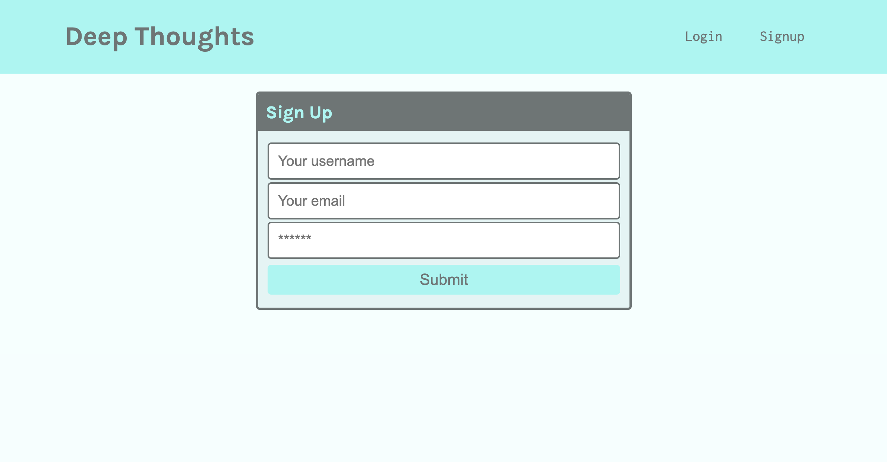
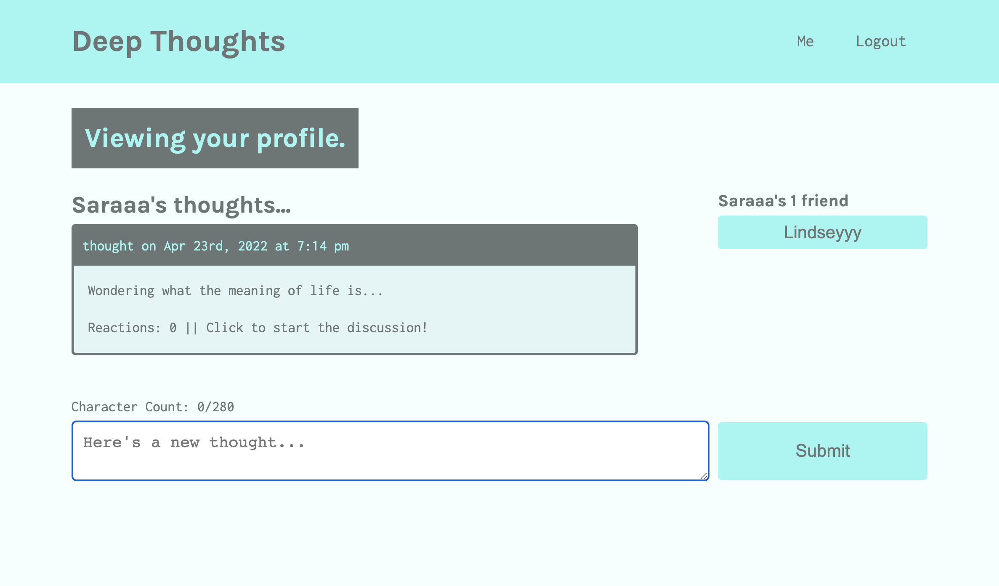
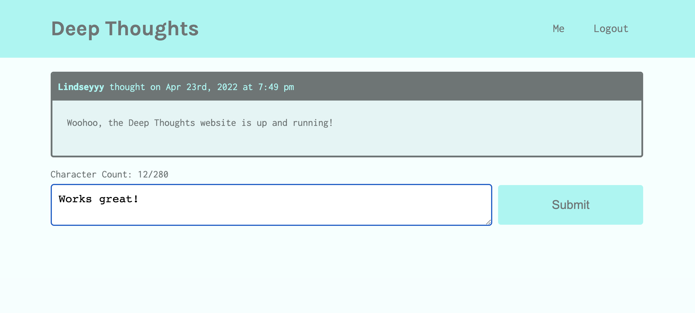
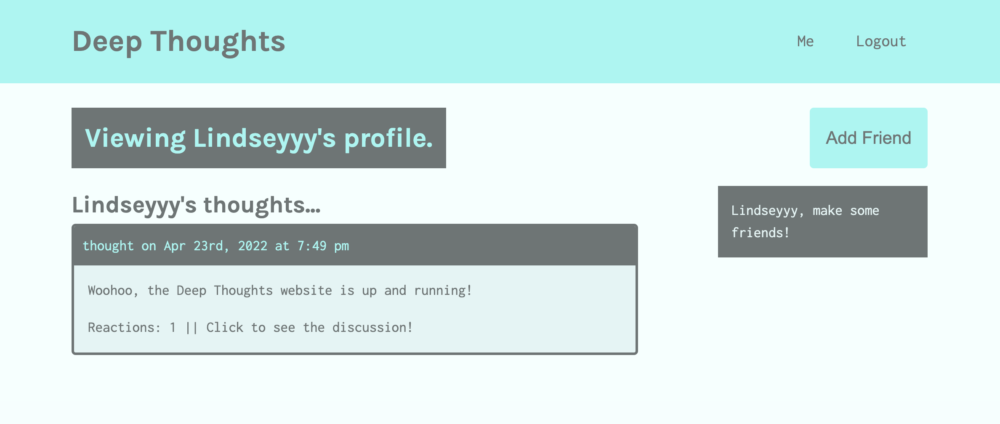

# Deep Thoughts

## Description
This repository contains the code for a MERN stack social media application called Deep Thoughts. Users will be able to sign up and create an account, post their thoughts, and interact with other users.  

## Deployed Website
This application is deployed on Heroku.  
https://immense-dusk-64707.herokuapp.com/ 

## Technologies Used
* MongoDB
* Mongoose
* GraphQL
* Apollo Server
* React
* Express
* JSON Web Token

## Usage
Users will need to first sign-up or login in order to create posts. 
 
  
 
Submit a thought from the homepage or your profile page.  
 

React to another user's post.  
 

Add friends so that you can easily find their posts.  
 

## Contribution
React frontend code provide by UW-Extended Campus Coding Bootcamp.  
Node, Express server, GraphQL API and MongoDB database implemented by Lindsey Dubnicka. 

## Questions
Feel free to reach out to me for any questions or comments.  
Link to my GitHub: github.com/lindseymiller2567